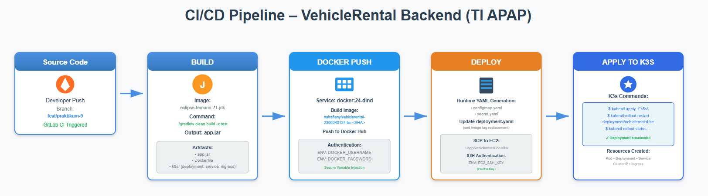
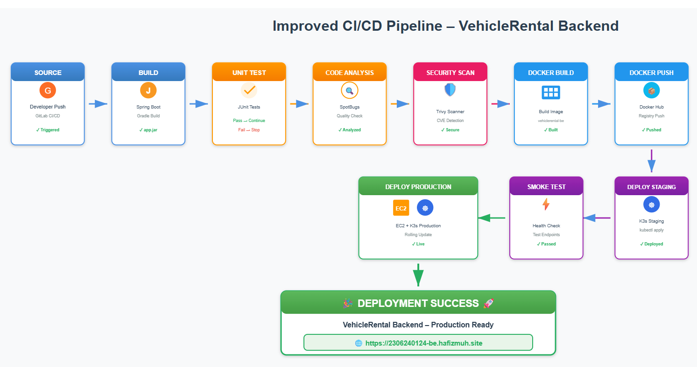

### **1. Masukan bukti screenshot bahwa kalian sudah berhasil melakukan deploy Sidating BE1, BE2 dan FE, serta BE dan FE Tugas Individu.**

**Jawaban:**


### **2. Buatlah gambar pipeline CI/CD kalian sendiri dan berikan deskripsi singkatnya.**

**Jawaban:**

Pipeline CI/CD untuk Backend TI terdiri dari **tiga tahap utama** yang berjalan otomatis di GitLab:

1. **Build**

   - Menggunakan image `eclipse-temurin:21-jdk`.
   - Menjalankan proses build Gradle hingga menghasilkan `app.jar`.
   - Artefak yang dihasilkan meliputi `app.jar`, `Dockerfile`, dan folder `k8s/`.

2. **Docker Push**

   - Menggunakan Docker-in-Docker untuk membangun image.
   - Image ditag menggunakan nilai `$CI_COMMIT_SHORT_SHA`.
   - Image kemudian di-push ke Docker Hub pada repository:
     `nairafiany/vehiclerental-2306240124-be`.

3. **Deploy**

   - GitLab CI menghasilkan `configmap.yaml` dan `secret.yaml` secara dinamis.
   - Tag image pada `deployment.yaml` diganti otomatis melalui perintah `sed`.
   - Semua file konfigurasi dikirim ke EC2 melalui SCP.
   - K3s menjalankan `kubectl apply` dan melakukan rolling restart terhadap deployment.

Pipeline ini memastikan bahwa setiap perubahan kode langsung melalui proses build → publish image → deploy ke server secara otomatis tanpa konfigurasi manual.

---

### **3. Buatlah gambar pipeline CI/CD Improvement dan penjelasan singkatnya.**

**Jawaban:**

Pipeline improvement yang lebih lengkap dan terstruktur dapat memiliki tahapan berikut:

1. Build
2. **Unit Test** (tahap baru)
3. **Static Code Analysis** seperti SpotBugs atau SonarLint
4. **Security Scan** terhadap Docker image menggunakan alat seperti Trivy
5. Docker Build
6. Docker Push
7. **Deploy ke Staging** (tahap baru)
8. **Smoke Test pada Staging** (tahap baru)
9. Deploy ke Production (EC2 + K3s)

**Alasan improvement:**

- Adanya _unit test_ dan _static analysis_ memastikan kualitas kode sebelum masuk tahap pengemasan.
- _Security scan_ membantu mendeteksi kerentanan image.
- Tahap _staging_ memisahkan proses uji coba dari production.
- _Smoke test_ memastikan layanan berjalan minimal sebelum dirilis ke pengguna.

---

### **4. Mengapa EC2 instance harus dikaitkan dengan Elastic IP? Apa yang terjadi jika tidak dikaitkan?**

**Jawaban:**
Elastic IP diperlukan agar alamat IP publik instance tetap konsisten walaupun AWS Academy menghentikan dan menjalankan ulang instance secara berkala. Tanpa Elastic IP:

- IP publik akan berubah setiap kali instance hidup kembali.
- Domain yang telah diarahkan ke IP sebelumnya menjadi tidak valid.
- GitLab CI/CD gagal melakukan SSH karena variabel `EC2_HOST` menjadi salah.
- Deployment harus dikonfigurasi ulang secara manual setiap kali instance restart.

Dengan Elastic IP, alamat server stabil dan seluruh pipeline dapat berjalan tanpa perubahan konfigurasi.

---

### **5. Apa perbedaan utama dari penggunaan Docker dan Kubernetes pada praktikum ini?**

**Jawaban:**

| Docker                                     | Kubernetes (K3s)                            |
| ------------------------------------------ | ------------------------------------------- |
| Fokus pada menjalankan container           | Fokus pada orkestrasi banyak container      |
| Tidak memiliki auto-healing                | Pod otomatis direstart jika mati            |
| Tidak menyediakan mekanisme domain routing | Ingress menangani routing domain            |
| Tidak mendukung scaling otomatis           | Mudah melakukan scaling dan rolling updates |
| Konfigurasi imperatif                      | Konfigurasi deklaratif melalui YAML         |

Dalam praktikum ini, Docker digunakan untuk membuat image aplikasi, sedangkan Kubernetes mengelola deployment, service, ingress, restart, dan routing domain.

---

### **6. Dari keseluruhan pipeline, proses mana yang paling penting dan mengapa?**

**Jawaban:**
Tahap yang paling krusial adalah **proses deploy**.

Alasannya:

- Pada tahap ini aplikasi benar-benar dirilis ke lingkungan production.
- Pembaruan konfigurasi, pemetaan image, dan pembuatan ulang pod berlangsung di sini.
- Kesalahan sekecil apa pun pada file YAML, environment variable, atau secret langsung berdampak pada aplikasi yang berjalan.

Tanpa tahap deploy yang benar, keseluruhan pipeline tidak memiliki efek terhadap lingkungan server.

---

### **7. Penjelasan kegunaan lima file konfigurasi Kubernetes (3 file di folder k8s + 2 file yang dibuat di CI/CD).**

**Jawaban:**

#### **1. deployment.yaml**

Mengatur bagaimana aplikasi berjalan di Kubernetes:

- menentukan image
- port aplikasi
- environment variables
- jumlah replicas
- label pod

#### **2. service.yaml**

Membuat Service tipe **ClusterIP** yang menyediakan alamat internal untuk pod.
Ingress menggunakan service ini sebagai target untuk routing.

#### **3. ingress.yaml**

Mengatur domain aplikasi (misalnya `2306240124-be.hafizmuh.site`).
Ingress ini meneruskan permintaan HTTP ke service internal.

#### **4. configmap.yaml** (dibuat otomatis oleh GitLab CI)

Menyimpan konfigurasi non-sensitive seperti:

- `DATABASE_URL_PROD`
- `DATABASE_USERNAME`

#### **5. secret.yaml** (dibuat otomatis oleh GitLab CI)

Menyimpan data sensitif seperti:

- `DATABASE_PASSWORD`
- `CORS_ALLOWED_ORIGINS`

Kelima file ini bekerja bersama untuk memastikan aplikasi berjalan dengan konfigurasi yang benar, aman, dan lengkap.

---

### **8. Di bagian mana sistem _start on restart_ diterapkan, dan bagaimana cara penerapannya?**

**Jawaban:**

#### **1. Docker – Database**

Restart otomatis diaktifkan melalui perintah berikut:

```
docker update --restart=always ubuntu-sidating-app-db-1
```

Dengan pengaturan ini, container database akan otomatis hidup kembali ketika instance EC2 di-reboot.

#### **2. Kubernetes – Deployment**

Deployment di Kubernetes secara alami memiliki mekanisme _self-healing_.
Ketika server restart, K3s akan memulai kembali seluruh deployment yang terdaftar dan membuat pod baru berdasarkan template pada `deployment.yaml`.

Dengan demikian, baik database maupun backend otomatis berjalan kembali tanpa perlu perintah manual.

---

### **9. Apa keuntungan dari menerapkan Kubernetes dibanding menjalankan Docker langsung di server?**

**Jawaban:**
Beberapa keuntungan utama:

1. **Self-healing** – pod dibuat ulang jika terjadi kegagalan.
2. **Rolling update** – pembaruan aplikasi dilakukan tanpa downtime.
3. **Ingress routing** – domain dapat diarahkan ke service internal dengan mudah.
4. **Konfigurasi deklaratif** – seluruh deployment tersimpan dalam file YAML.
5. **Service discovery** – backend memiliki DNS internal untuk komunikasi antar-layanan.
6. **Scalability** – replica dapat ditambah atau dikurangi dengan satu konfigurasi.

Dengan Kubernetes, sistem lebih stabil, lebih mudah dikelola, dan siap menghadapi perubahan skala.

---

### **10. Jelaskan perbedaan antara ClusterIP, NodePort, dan LoadBalancer serta alasan ClusterIP dipilih pada praktikum ini.**

**Jawaban:**

| Jenis Service    | Penjelasan                                                                                          |
| ---------------- | --------------------------------------------------------------------------------------------------- |
| **ClusterIP**    | Hanya bisa diakses dari dalam cluster. Digunakan untuk routing internal.                            |
| **NodePort**     | Membuka port pada node untuk akses publik. Tidak direkomendasikan untuk produksi.                   |
| **LoadBalancer** | Menggunakan layanan cloud provider untuk menyediakan IP publik khusus. Biasanya dipakai di AWS/GCP. |

**Alasan penggunaan ClusterIP:**

- Sistem menggunakan Ingress (Traefik) sebagai gerbang masuk aplikasi.
- Ingress bekerja optimal bila service bersifat internal.
- Tidak diperlukan NodePort atau LoadBalancer karena domain sudah diarahkan ke ingress.
- Konfigurasi lebih aman dan lebih sederhana untuk lingkungan K3s pada EC2.

---

### **11. Apa pelajaran terpenting dari proses deployment otomatis ini, dan bagaimana CI/CD dapat diterapkan pada proyek lain?**

**Jawaban:**
Pelajaran terpenting dari praktikum ini adalah bahwa **automasi sangat penting dalam memastikan konsistensi deployment**, mengurangi human error, dan mempercepat proses integrasi perubahan kode. Dengan CI/CD, setiap perubahan yang dikirim ke repository langsung diuji, dikemas, dan dirilis ke server tanpa perlu langkah manual.

Konsep CI/CD dapat diterapkan pada proyek apa pun dengan pola berikut:

- Otomatisasi build untuk setiap push.
- Menjalankan test unit secara otomatis.
- Mengemas aplikasi dalam image yang reproducible.
- Mendorong image ke registry.
- Melakukan deployment otomatis ke staging atau production.
- Menggunakan YAML deklaratif untuk memperjelas konfigurasi.

Dengan pendekatan tersebut, proses pengembangan menjadi lebih stabil, terstruktur, dan dapat di-scale secara mudah.
